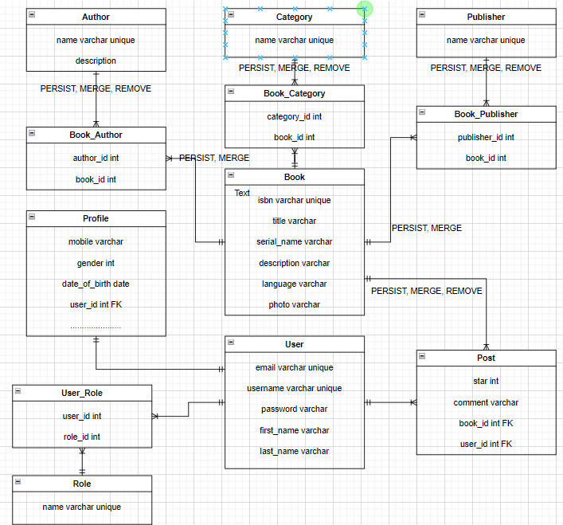

# library-react-thymeleaf-springboot
An library management system with spring boot backend, react, and Thymeleaf frontend. This app focus on Spring data JPA with many-to-many relationships, Web MVC Configuration to allow Reactjs accesses the resources, Swagger-ui to help frontend devs understand inputs and outputs of the Apis.

In **Many to Many** Relationship
- Cascade.PERSIST: When we save an entity, another related entity that is associated with will be saved to the database.
- Cascade.MERGE: the related entities are merged when the owning entity is merged.
- Cascade.REFRESH: refresh automatically when we update or delete,...
- Cascade.REMOVE: removes all related entities association with this setting when the owning entity is deleted.
- FetchType.LAZY: when we retrieve an parent entity, the child entity will not be returned with the the parent entity.
- FetchType.EAGER: when we retrieve an parent entity, the child entity will be returned with the the parent entity.

